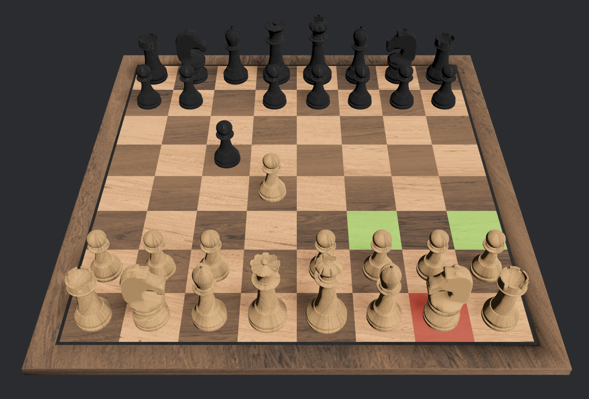
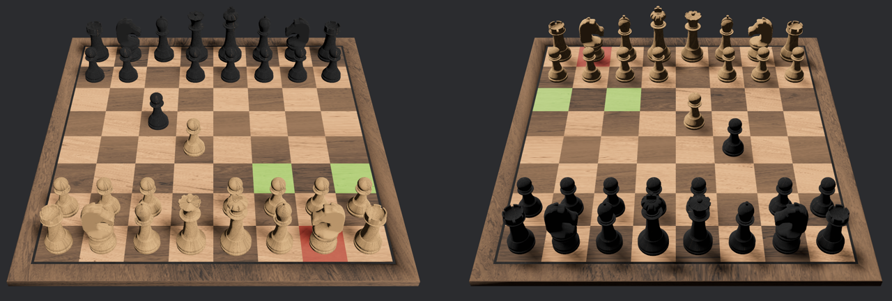

# Readme

This is my own implementation of chess "from scratch" learning bevy and more rust concepts.
I do this just for fun- do not expect quality code here :D

There is also a real chess-rust engine out there, which is probably pretty good!
I did not look into it to much, cause I mainly wanted to have fun with my own ideas.

## Singleplayer mode (vs MinMax with Alpha Beta Pruning)


## Local Multiplayer - Splitscreen Mode



## Bevy concepts I tried out here which might help you in your first game

- Using the gltf file format via blender export and how to query specific nodes (e.g. chess pieces) from the format.
- Using asynchronous tasks to run my (very bad, but from scratch) chess engine
- Using bevy ui and settings
- Using Messages
- Split screen mode with different camera viewports
- Using states to only run systems in certain states
- Using bevy picking - this is still a little bit of a mess since I had some problems; but it works
- 

## Notes:

- Click the tiles under the figures, currently only those are pickable
- The hard difficulty will take extremely long as my minmax implementation /move ordering is pretty bad. I plan to improve it in the future. I recommend by trying the medium difficulty
- I probably made some terrible descision in my move generation logic and in the structure :D But hey, at least maybe it is something new :D
- For quitting the game, close the window. I had some problems with the App Exit Writer.

## How to run

1. Install rust
2. cargo run --release
3. Wait for compilation, next time will be faster :D

## Credits

Thanks to all the official bevy examples in the repo - it was kind of fun to adapt them for my own purposes :)


Thanks to the author Theo Müller of this very nice blender chess asset!
I tried to create my own, but only ended up making a donut...


The asset itself I got from blenderkit, under the RF license:
```md
This license protects the work in the way that it allows commercial use without mentioning the author, but doesn't allow for re-sale of the asset in the same form (eg. a 3D model sold as a 3D model or part of assetpack or game level on a marketplace).
```

I just baked some textures so I could use them with the gltf format.


